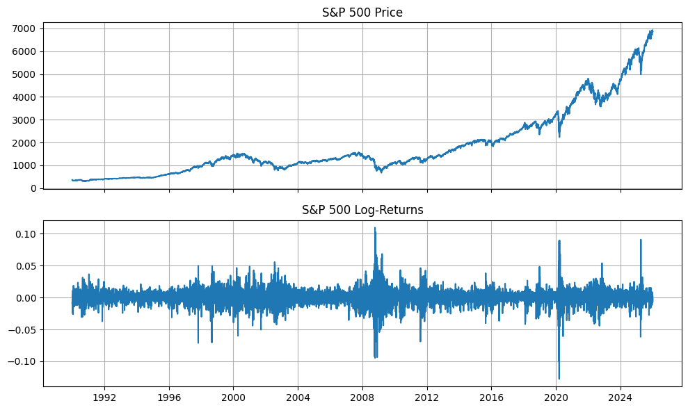

# Volatility — Core Concepts

## Definition

**Volatility** refers to the statistical measure of **dispersion of returns** or values over time.

It is measured as the **standard deviation of log returns**:

$$\sigma = \sqrt{\frac{1}{N-1} \sum_{i=1}^{N} (r_i - \bar{r})^2}$$

where $r_i = \ln\left(\dfrac{P_i}{P_{i-1}}\right)$ are the **log returns** of a price series.

---

## Why Log Returns?

They are used because they are:

- **Time-additive** — you can sum them across periods
- **Approximately normally distributed** — which makes math cleaner
- **Symmetric** — a 50% gain and 50% loss don't cancel out with simple returns, but do with log returns

---

## The Natural Logarithm — Intuition via Compounding

Consider $\$1000$ invested at an annual rate of **100%**. How much do you have after 1 year?

It depends on how frequently interest is compounded:

| Compounding | Formula | Result |
|---|---|---|
| 1× per year | $1000 \cdot (1 + 1)^1$ | $\$2000$ |
| 2× per year | $1000 \cdot \left(1 + \frac{1}{2}\right)^2$ | $\$2250$ |
| 4× per year | $1000 \cdot \left(1 + \frac{1}{4}\right)^4$ | $\approx \$2441$ |
| $n \to \infty$ | $1000 \cdot \lim_{n \to \infty}\left(1 + \frac{1}{n}\right)^n$ | $1000 \cdot e \approx \$2718$ |

The limit defines Euler's number:

$$e = \lim_{n \to \infty}\left(1 + \frac{1}{n}\right)^n \approx 2.718$$

### Interpreting $e$ and $\ln$

> If $e$ answers *"by what factor does something grow in one unit of time under continuous compounding?"*,  
> then $\ln$ answers *"how long did it take for something to grow by that factor?"*

- $1000 \cdot e^1$ — value after **1 year**
- $1000 \cdot e^2$ — value after **2 years**
- $e$ is essentially a **multiplier of continuous growth**

**How much continuous growth happened when price went from 100 to 200?**

$$r = \ln\!\left(\frac{200}{100}\right) = \ln(2) \approx 0.693$$

This means: under continuous compounding, **69.3% growth** over the period — that is your log return.

---

## Annualizing Volatility

Daily volatility is typically scaled to an annual figure for comparison across assets and time periods.

$$\sigma_{\text{annual}} = \sigma_{\text{daily}} \times \sqrt{252}$$

where **252** is the conventional number of trading days in a year.

> This scaling follows from the **square-root-of-time rule**: if daily returns are independent and identically distributed, variance grows linearly with time, so standard deviation grows with $\sqrt{T}$.

$$\text{Var}_{T} = T \cdot \text{Var}_{1} \implies \sigma_T = \sigma_1 \cdot \sqrt{T}$$

# Chapter 2. Theoretical Foundations and Data Preparation

## 2.1 Stationarity of Time Series

### 2.1.1 Definition

A time series $\{X_t\}$ is said to be **weakly (covariance) stationary** if the following three conditions hold simultaneously:

$$\mathbb{E}[X_t] = \mu \qquad \text{(constant mean)}$$

$$\text{Var}(X_t) = \sigma^2 \qquad \text{(constant variance)}$$

$$\text{Cov}(X_t,\, X_{t+k}) = \gamma(k) \qquad \text{(autocovariance depends only on lag } k \text{, not on } t \text{)}$$

Weak stationarity requires that the statistical structure of the series does not shift over time. Strong stationarity imposes a stricter condition — that the entire joint distribution is time-invariant — but in practice, weak stationarity is sufficient for most econometric models.

---

### 2.1.2 Expectation

The **expected value** (expectation) of a random variable $X$ is the probability-weighted average of all possible outcomes — the value one would observe on average over an infinite number of trials:

$$\mathbb{E}[X] = \sum_{x} x \cdot P(X = x) \qquad \text{(discrete case)}$$

$$\mathbb{E}[X] = \int_{-\infty}^{\infty} x \cdot f(x)\, dx \qquad \text{(continuous case)}$$

**Example.** For a fair six-sided die, no single roll produces the expected value, yet over many trials the average converges to it:

$$\mathbb{E}[X] = 1 \cdot \frac{1}{6} + 2 \cdot \frac{1}{6} + 3 \cdot \frac{1}{6} + 4 \cdot \frac{1}{6} + 5 \cdot \frac{1}{6} + 6 \cdot \frac{1}{6} = 3.5$$

Applied to the stationarity condition $\mathbb{E}[X_t] = \mu$: regardless of the point in time $t$, the average value of the series must remain the same. As an illustration, the S&P 500 index price violates this condition — its mean grew from approximately 350 in 1990 to 5000 in 2024 — whereas the daily log returns fluctuate around a mean of approximately zero across all observed periods:

$$\mathbb{E}[P_t] \neq \mathbb{E}[P_{t+k}] \quad \Rightarrow \quad \text{price series: NOT stationary}$$

$$\mathbb{E}[r_t] \approx 0 \quad \forall\, t \quad \Rightarrow \quad \text{log returns: stationary in mean} \checkmark$$

---

### 2.1.3 Variance

**Variance** quantifies the degree of dispersion of a random variable around its mean:

$$\text{Var}(X) = \mathbb{E}\!\left[(X - \mu)^2\right]$$

Intuitively, each observation is subtracted from the mean, squared (to eliminate sign), and averaged. The result measures how widely the values are spread.

The stationarity condition $\text{Var}(X_t) = \sigma^2$ requires this spread to be constant over time. In the context of financial returns, this property is frequently violated: daily S&P 500 swings reached $\pm 3$–$5\%$ during the 2008 financial crisis, while remaining near $\pm 0.3\%$ during the calm period of 2017.

This phenomenon — time-varying conditional variance — is termed **heteroskedasticity**:

$$\text{Var}(r_t \mid r_{t-1}, r_{t-2}, \ldots) = \sigma_t^2 \neq \text{const}$$

It is important to distinguish between **unconditional** and **conditional** variance. The unconditional variance of log returns remains finite and stable over long horizons, satisfying the stationarity requirement. The conditional variance, however, changes over time and constitutes the primary object of study in volatility modelling. This distinction is precisely what GARCH-family and regime-switching models are designed to exploit.

---

### 2.1.4 Autocovariance

The third stationarity condition concerns the **autocovariance** — the covariance of the series with a lagged version of itself:

$$\text{Cov}(r_t,\, r_{t+k}) = \gamma(k)$$

Here, $r_t$ denotes the return at time $t$ and $r_{t+k}$ the return $k$ periods later. The condition states that this relationship depends **only on the lag** $k$, not on the absolute position in time $t$. Concretely:

$$\text{Cov}(r_1, r_4) = \text{Cov}(r_{100}, r_{103}) = \text{Cov}(r_{1000}, r_{1003}) = \gamma(3)$$

The economic interpretation of $\gamma(k)$ is as follows:

| Sign of $\gamma(k)$ | Interpretation |
|---|---|
| $\gamma(k) > 0$ | Returns exhibit **momentum** — a move in one direction tends to persist after $k$ periods |
| $\gamma(k) < 0$ | Returns exhibit **mean reversion** — a move tends to reverse after $k$ periods |
| $\gamma(k) = 0$ | Returns carry **no memory** — past returns have no predictive power at lag $k$ |

All three cases are consistent with stationarity. What would break stationarity is instability of $\gamma(k)$ across time — for instance, if returns show strong positive autocorrelation during crises (panic selling reinforces itself) but zero autocorrelation during calm periods. In that case, the autocovariance structure depends on $t$, violating the condition.

This is precisely the tension addressed by regime-switching models: within a single regime, $\gamma(k)$ remains stable; across regimes it may differ. A pooled model that ignores regime membership will exhibit apparent non-stationarity — providing the core motivation for the regime-based framework developed in this thesis.

---

### 2.1.5 Why Non-Stationary Series Cannot Be Modelled Reliably

A model trained on non-stationary data fits the trend rather than the underlying data-generating process, and therefore lacks predictive validity. Three specific failure modes arise:

**Spurious regression.** Two unrelated non-stationary series that share an upward trend will appear strongly correlated. A model will identify a relationship that has no causal basis and will not generalise.

**Meaningless parameter estimates.** The mean and variance estimated from a trending series describe no particular moment in time. They represent an average over a constantly shifting distribution.

**Model assumption violation.** GARCH, Hidden Markov Models, and regression-based approaches all require a stable data-generating process. If the mean is drifting, the model misinterprets systematic trend as volatility shocks, producing distorted estimates.

The transformation to log returns resolves the mean non-stationarity. The residual heteroskedasticity — time-varying conditional variance — is not a problem to be eliminated but a signal to be modelled.

---

## 2.2 Data Acquisition and Preparation

### 2.2.1 Dataset

The empirical analysis is conducted on daily closing prices of the S&P 500 index (ticker: `^GSPC`) from January 1990 to the present, sourced via the `yfinance` library. The dataset encompasses approximately 9,000 trading days, covering multiple distinct market cycles including the Dot-com crash (2000–2002), the Global Financial Crisis (2008–2009), the COVID-19 shock (2020), and subsequent recovery periods.

### 2.2.2 Implementation

The following libraries are used throughout the analysis:

```python
import pandas as pd
import numpy as np
import yfinance as yf
import matplotlib.pyplot as plt
from statsmodels.tsa.stattools import adfuller
from sklearn.cluster import KMeans
```

**Data download and cleaning:**

```python
sp500 = yf.download(
    "^GSPC",
    start="1990-01-01",
    auto_adjust=True,
    progress=False
)

sp500 = sp500.sort_index()
sp500 = sp500[["Close"]].dropna()
```

The resulting dataset contains adjusted closing prices indexed by date. The first five observations are shown below:

| Date | Close |
|---|---|
| 1990-01-02 | 359.69 |
| 1990-01-03 | 358.76 |
| 1990-01-04 | 355.67 |
| 1990-01-05 | 352.20 |
| 1990-01-08 | 353.79 |

**Log return computation:**

Daily log returns are computed as the first difference of the log-transformed price series:

$$r_t = \ln P_t - \ln P_{t-1} = \ln\!\left(\frac{P_t}{P_{t-1}}\right)$$

```python
sp500["log_return"] = np.log(sp500["Close"]).diff()
sp500 = sp500.dropna()
```

The resulting series for the first five observations:

| Date | Close | log\_return |
|---|---|---|
| 1990-01-03 | 358.76 | −0.002589 |
| 1990-01-04 | 355.67 | −0.008650 |
| 1990-01-05 | 352.20 | −0.009804 |
| 1990-01-08 | 353.79 | +0.004504 |
| 1990-01-09 | 349.62 | −0.011857 |

**Descriptive statistics of the log return series:**

```python
sp500["log_return"].describe()
```

| Statistic | Value |
|---|---|
| Count | 9,067 |
| Mean | 0.000325 |
| Std | 0.011384 |
| Min | −0.127652 |
| 25th percentile | −0.004436 |
| Median | 0.000602 |
| 75th percentile | 0.005694 |
| Max | 0.109572 |

The mean log return is near zero (0.03% daily), consistent with the stationarity in mean requirement. The standard deviation of approximately 1.14% constitutes the baseline volatility estimate. The minimum of −12.77% corresponds to the largest single-day crash in the sample period.

---

### 2.2.3 Visual Comparison: Price vs. Log Returns

The distinction between a non-stationary and a stationary series is most clearly illustrated visually. Figure 2.1 presents both series over the full sample period.

```python
fig, ax = plt.subplots(2, 1, figsize=(10, 6), sharex=True)

ax[0].plot(sp500.index, sp500["Close"])
ax[0].set_title("S&P 500 Price")
ax[0].grid(True)

ax[1].plot(sp500.index, sp500["log_return"])
ax[1].set_title("S&P 500 Log Returns")
ax[1].grid(True)

plt.tight_layout()
plt.show()
```



The upper panel exhibits a clear upward trend with expanding variance — characteristic of a non-stationary process. The lower panel fluctuates around zero with no discernible trend, though periods of elevated variance (notably 2008–2009 and 2020) are clearly visible. This **volatility clustering** — the tendency for large moves to follow large moves — is the empirical phenomenon that motivates GARCH and regime-switching modelling.

---

### 2.2.4 Stationarity Test: Augmented Dickey-Fuller

To formally verify the stationarity of the log return series, the **Augmented Dickey-Fuller (ADF) test** is applied. The null hypothesis of the test is the presence of a unit root (non-stationarity). Rejection at the 5% significance level ($p < 0.05$) provides statistical evidence of stationarity.

```python
p_value = adfuller(sp500["log_return"].dropna())[1]
```

A $p$-value substantially below 0.05 confirms that the log return series is stationary in mean, satisfying the prerequisite for the volatility models applied in subsequent chapters.